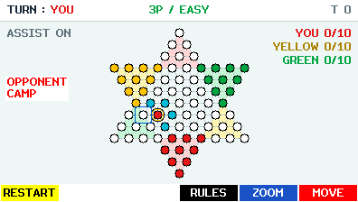
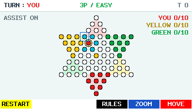
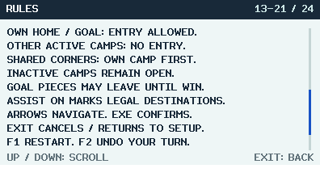
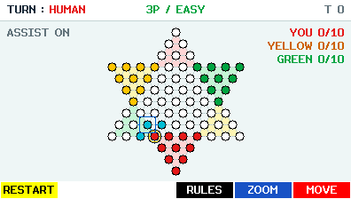
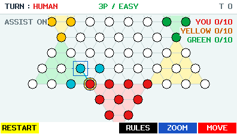
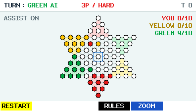
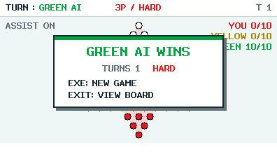
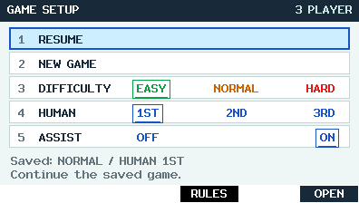

# DIAMOND for CASIO fx-CG50


**Ten pieces. One opposite camp. Race the AI across a 73-hole star.**

A native Korean Diamond Game for CASIO fx-CG50. You are **RED (YOU)**:
play GREEN in 2P, or independent YELLOW and GREEN opponents in 3P.
Choose EASY, NORMAL or HARD, with optional legal-move hints, zoom, undo and resume.

[한국어 안내](README_KO.md) · [Download beta.4](https://github.com/omegalpha210/fx-cg50-diamond/releases/tag/v0.1.0-beta.4) · [Full rules](docs/GAME_RULES.md)

| 2P · YOU vs GREEN | 3P · YOU vs YELLOW and GREEN |
|---|---|
|  |  |

**These are beta.4 V2 screens.** New games apply the corrected camp-entry rules
shown below. Screenshots are 396 × 224 host captures from the game's actual
renderer, not photographs of a calculator. Rule and endgame examples use
prepared, engine-valid V2 positions; [capture details](docs/screenshots/README.md).

## How to play

1. Select one of your RED pieces with **EXE**.
2. Move to an adjacent empty hole, or jump over an adjacent piece into the empty
   hole immediately beyond it. Chain jumps, change direction, or stop after any jump.
3. Fill the opposite ten-hole camp first to win. For YOU, that is the top camp.

All pieces have the same abilities. There is no capture or king. A turn uses
steps **or** jumps, never both. Retracing during a chain is allowed, but finishing
back on the starting hole is not. Goal pieces may leave until someone wins.

## The corrected camp rules, in pictures

**HOME** is your starting camp; **GOAL** is the opposite camp. Each includes its
four-hole inner boundary row. Some corner holes belong to two camps.
Apply this order to every landing, including intermediate jump landings:

| Landing belongs to… | Can your piece enter? |
|---|---|
| Your own HOME or GOAL, including a shared corner | **Yes**, subject to the normal move and occupancy rules |
| An active opponent's HOME or GOAL, but neither of yours | **No** |
| Neutral space, or an inactive camp with no active opponent membership | **Yes**, subject to the normal move and occupancy rules |

| Opponent-only camp: blocked | Your own shared GOAL corner: allowed |
|---|---|
|  |  |
| The cursor targets GREEN's goal boundary. **OPPONENT CAMP** appears; that hole is not a cyan legal destination. | The top-left shared corner is both RED GOAL and YELLOW HOME. RED may enter because it is RED's own GOAL. |

Shared corners have **player-relative permission**, not a single preferred owner
color. The opponent-camp restriction and four-hole boundary come from the
owner-supplied Korean manual; own-camp precedence at shared corners is the
[documented project interpretation](docs/RULE_SOURCES.md). The actual 73-hole
board is unchanged. In 2P, inactive YELLOW territory alone does not block entry.



## See your legal moves

With **ASSIST ON**, cyan holes are legal destinations. Select a piece, move the
cursor to a destination, then press EXE to commit. **F5** switches between the
whole board and a larger view while keeping your selection.

| Whole board · selected RED piece | F5 · the same selection enlarged |
|---|---|
|  |  |

ASSIST OFF hides the hints. A displayed jump route is one shortest representative
path; human input, Assist and AI all use the same engine legality checks.
AI moves replay with directional trails that remain until your next legal move.

## Finish all ten

The right-hand counters show how many pieces each player has in their GOAL.
In this prepared V2 endgame, GREEN has **9/10**, then the actual AI makes the
winning move and the game shows **10/10** after its replay.

| One piece left to place | Final piece arrives · GREEN wins |
|---|---|
|  |  |

EASY offers lighter opposition; NORMAL and HARD search further. In 3P, each AI
plays for its own win. Beta.4 improves final-hole play and takes an immediate
legal win at every difficulty. [AI design and measured limits](docs/AI_DESIGN.md).

## Install, start and resume

Download **DIAMOND.g3a** and **SHA256SUMS.txt** from the
[beta.4 release](https://github.com/omegalpha210/fx-cg50-diamond/releases/tag/v0.1.0-beta.4).
Verify the checksum, copy the G3A to the fx-CG50 storage root over USB, safely
disconnect, and launch DIAMOND in the CASIO Main Menu.

```sh
shasum -a 256 -c SHA256SUMS.txt
```

| 1 · Choose 2P or 3P | 2 · Choose your settings and start |
|---|---|
|  |  |

- **PLAYER:** choose 2P/3P, then EXE/F6 NEXT. **F1 RESUME** continues the one saved
  game, even if the other player-count tile is selected.
- **GAME SETUP:** use UP/DOWN to choose a row and LEFT/RIGHT to change difficulty,
  your first/turn slot, or Assist. Choices stop at each end.
- **NEW GAME:** EXE/F6 OPEN starts a new game from every row except RESUME.
  A matching saved game adds a RESUME row; select it to continue that game.

**Want the corrected rules? Choose NEW GAME.** Old V1 saves deliberately keep
their original rules on RESUME and RESTART. Their rules screen says
**LEGACY RULES**. New V2 games use the camp rules pictured above.

## Controls during play

| Key | Action |
|---|---|
| Arrows | Move cursor in overview/zoom |
| EXE / F6 | Select your RED piece, then commit a legal destination |
| EXIT | Deselect → zoom out → save and return to setup |
| F1 | Restart after confirmation |
| F2 | Undo one YOU decision and all following AI replies, once |
| F4 | Read scrollable rules |
| F5 | Toggle overview / zoom |
| MENU | Save and open the CASIO Main Menu |
| SHIFT + AC/ON | Save and power off |

One unfinished game is kept in alternating checksummed A/B files. Cursor movement
and AI search do not write flash. [Save and recovery details](docs/STORAGE_FORMAT.md).

**Experimental beta — HARDWARE TEST REQUIRED.** Host tests and package checks
pass. Calculator display, persistence, power behavior, AI latency and USB
connection handling still need [hardware checks](docs/HARDWARE_RETEST.md).
USB handoff remains experimental; beta.4 does not claim a USB fix.
[Beta.4 evidence](docs/BETA4_AUDIT.md) · [USB audit](docs/USB_LIFECYCLE_AUDIT.md).

## Build and validate

Requires CMake, a C11 compiler and Python 3 for host tests. The native build
requires fxSDK, gint 2.11 and the SH cross compiler. Set `DIAMOND_SDK_ROOT` to
your SDK prefix layout; its default is `$HOME/.local/diffeq-sdk`.

```sh
bash tools/test.sh
bash tools/build.sh
cmake -S . -B build/ubsan -DDG_HOST=ON -DDG_SANITIZE=ON -DCMAKE_BUILD_TYPE=Debug
cmake --build build/ubsan -j8
ctest --test-dir build/ubsan --output-on-failure
```

The native build produces `dist/DIAMOND.g3a` and `dist/SHA256SUMS.txt`.
Pillow is needed only for font/icon regeneration and screenshot conversion;
committed source assets build without it. [Development](docs/DEVELOPMENT.md),
[validation](docs/BETA_VALIDATION.md), [memory](docs/MEMORY.md),
[actual renderer captures](docs/screenshots/README.md), and
[publication provenance](docs/PUBLICATION.md) record the beta's evidence.
[Move visualization](docs/AI_MOVE_VISUALIZATION.md) and
[color audit](docs/UI_COLOR_AUDIT.md) record the current presentation.
[Historical beta.2 audit](docs/UI_POLISH_BETA2.md) records the preceding UI milestone.
Host milliseconds are not fx-CG50 timings; this AI is bounded, selective search.

## Rules and license

Rules combine an owner-supplied physical Korean manual transcription with
independent summaries of [Korea Board Games](https://www.koreaboardgames.com/magazine/menuDetail?boardCd=contents&postNo=314)
and [Korean Wikipedia](https://ko.wikipedia.org/wiki/다이아몬드_게임).
[Source decisions](docs/RULE_SOURCES.md) and [geometry](docs/BOARD_GEOMETRY.md)
explain the conventional 73-hole star: adjacent ten-hole camps share six boundary
corners, leaving 19 holes outside their union.

Original game code, generated board/icons and own renderer captures use the
[MIT license](LICENSE). Adapted helpers, the gint font and linked runtimes retain
[their own notices](THIRD_PARTY_NOTICES.md). No source article, board photo,
Sokoban map or private reference screenshot is distributed. CASIO compatibility
does not imply affiliation or endorsement.
