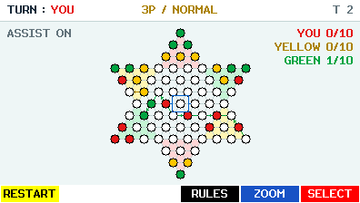

# DIAMOND for CASIO fx-CG50


A native Korean 73-hole Diamond Game. Play RED against GREEN in two-player
mode, or against independent GREEN and YELLOW AI players in three-player mode.
Move ten equal pieces into the opposite camp with steps and chained jumps.

[한국어](README_KO.md) · [Download beta](https://github.com/omegalpha210/fx-cg50-diamond/releases/tag/v0.1.0-beta.3) · [Rules](docs/GAME_RULES.md)



**Experimental beta — HARDWARE TEST REQUIRED.** Host tests and package checks
pass; calculator display, persistence, power behavior and AI latency still need
the [46 hardware checks](docs/HARDWARE_RETEST.md).

- **2P / 3P:** the human is always RED. Choose the first player or your turn slot.
- **EASY / NORMAL / HARD:** green / readable gold / red labels in numbered setup rows.
  EASY uses seeded heuristic choices; NORMAL uses a small bounded search; HARD
  uses a larger bounded search. Two-player search uses alpha-beta; three-player search
  uses MaxN with each AI maximizing its own score. [Measured audit](docs/AI_DIFFICULTY_AUDIT.md).
- **AI moves:** only the final chosen move animates, at 117.1875ms per hop by RTC time.
  GREEN/YELLOW directional trails remain until your next legal move.
  [Animation and trail behavior](docs/AI_MOVE_VISUALIZATION.md).
- **ASSIST:** cyan filled holes mark legal destinations. Turn it off for unaided play.
- **UNDO:** take back one human decision and all following AI replies, once.
- **RESTART:** confirm a fresh board with the same seed, difficulty and turn order.
- **ZOOM:** toggle the enlarged board without changing selection or navigation.
- **RESUME:** one unfinished game, with alternating checksummed A/B saves and recovery.
- **Power:** system dim/APO settings, physical-key wake and committed-state checkpoints
  before MENU/OFF/APO. [Implementation and test limits](docs/POWER_AUDIT.md).


## Install

Download `DIAMOND.g3a` and `SHA256SUMS.txt` from the
[beta release](https://github.com/omegalpha210/fx-cg50-diamond/releases/tag/v0.1.0-beta.3).
Verify the checksum, copy the G3A to the fx-CG50 storage root over USB, safely
disconnect, and launch DIAMOND in the CASIO Main Menu.

```sh
shasum -a 256 -c SHA256SUMS.txt
```

PLAYER defaults to 3P. EXE/F6 NEXT opens GAME SETUP. An unfinished save enables
F1 RESUME globally, even when the other player-count tile is selected. F2 stays blank.
The red circles contain white profile silhouettes; AI circles retain centered AI text.

GAME SETUP uses numbered rows: optional matching RESUME, NEW GAME, DIFFICULTY,
FIRST (2P) or YOU (3P), and ASSIST last. UP/DOWN moves row focus.
LEFT/RIGHT clamps EASY → NORMAL → HARD, YOU/AI first, 1ST/2ND/3RD human slot,
or OFF/ON Assist. EXE/F6 OPEN resumes only on RESUME; every other row starts a
new game with the current settings. RESUME retains saved difficulty, turn order,
CPU order, seed/RNG and undo; Assist is the global preference. F4 RULES remains available.

TURN actors and full goal fractions use RED / gold / GREEN. The entire centered
mode/difficulty label uses green / gold / red. During search, fixed-origin
THINKING dots cycle every 312.5ms without consuming RNG or resetting idle.

## Controls

| Key | Action |
|---|---|
| Arrows | Move cursor in overview/zoom; change menu choices |
| EXE / F6 | Select your RED piece, then commit a legal destination |
| EXIT | Deselect → zoom out → checkpoint and return to setup |
| F1 | Confirm restart |
| F2 | Undo one human decision and all following AI replies |
| F4 | Read scrollable rules |
| F5 | Toggle overview / zoom |
| MENU | Checkpoint and open the real CASIO Main Menu |
| SHIFT + AC/ON | Checkpoint and power off through gint |

ASSIST ON includes every legal final jump landing. The displayed path is one
shortest representative route. Retracing is allowed during a jump chain; a turn
ending on its starting hole is excluded. Steps and jumps cannot mix in a turn.
No capture, king pieces or Japanese camp restrictions are used. Goal pieces may
leave until someone wins. The first player with all ten pieces in the goal wins.

`DGSTATEA.dat` and `DGSTATEB.dat` are generations of one archive. Search and
cursor redraws do not write flash. New games replace the resume after verified
storage success. Old EASY/HARD v1 saves retain IDs 0/1; NORMAL uses ID 2 in the
same format. [Save specification](docs/STORAGE_FORMAT.md).

## Build and validate

Requires CMake, a C11 compiler and Python 3 for host tests. The native build
requires fxSDK, gint 2.11 and the SH cross compiler. Set `DIAMOND_SDK_ROOT` to
your SDK prefix layout; its default is `$HOME/.local/diffeq-sdk`.

```sh
bash tools/test.sh
bash tools/build.sh
cmake -S . -B build/ubsan -DDG_HOST=ON -DDG_SANITIZE=ON -DCMAKE_BUILD_TYPE=Debug
cmake --build build/ubsan -j8
ctest --test-dir build/ubsan --output-on-failure
```

The native build produces `dist/DIAMOND.g3a` and `dist/SHA256SUMS.txt`.
Pillow is needed only for font/icon regeneration and screenshot conversion;
committed source assets build without it. [Development](docs/DEVELOPMENT.md),
[validation](docs/BETA_VALIDATION.md), [memory](docs/MEMORY.md),
[actual renderer captures](docs/screenshots/README.md), and
[publication provenance](docs/PUBLICATION.md) record the beta's evidence.
[Move visualization](docs/AI_MOVE_VISUALIZATION.md) and
[color audit](docs/UI_COLOR_AUDIT.md) record the current presentation.
[Historical beta.2 audit](docs/UI_POLISH_BETA2.md) records the preceding UI milestone.
Host milliseconds are not fx-CG50 timings; this AI is bounded, selective search.

## Rules and license

Rules are independently summarized from
[Korea Board Games](https://www.koreaboardgames.com/magazine/menuDetail?boardCd=contents&postNo=314)
and [Korean Wikipedia](https://ko.wikipedia.org/wiki/다이아몬드_게임).
[Source decisions](docs/RULE_SOURCES.md) and [geometry](docs/BOARD_GEOMETRY.md)
explain the conventional 73-hole star: adjacent ten-hole camps share six boundary
corners, leaving 19 holes outside their union.

Original game code, generated board/icons and own renderer captures use the
[MIT license](LICENSE). Adapted helpers, the gint font and linked runtimes retain
[their own notices](THIRD_PARTY_NOTICES.md). No source article, board photo,
Sokoban map or private reference screenshot is distributed. CASIO compatibility
does not imply affiliation or endorsement.
