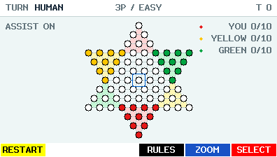
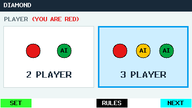
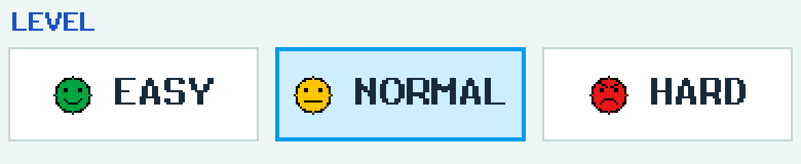

# CASIO fx-CG50용 DIAMOND


한국식 73칸 다이아몬드 게임을 계산기에서 즐기는 네이티브 애드인입니다.
인간은 항상 **RED**입니다. 2P에서는 GREEN AI와, 3P에서는 각자 독립적으로
판단하는 GREEN·YELLOW AI와 대결합니다. 동일한 능력의 말 10개를 반대편
진영으로 먼저 옮기면 승리합니다.

[English](README.md) · [베타 다운로드](https://github.com/omegalpha210/fx-cg50-diamond/releases/tag/v0.1.0-beta.1) · [규칙](docs/GAME_RULES.md)



**실험적 beta — HARDWARE TEST REQUIRED.** 호스트 테스트와 패키지 검사로
검증한 버전입니다. 실제 fx-CG50 화면·저장·전원 동작·AI 응답 시간은
[28개 실기 체크리스트](docs/HARDWARE_RETEST.md)로 확인해야 합니다.

- **2P / 3P:** 선공 또는 인간의 차례 위치를 선택합니다.
- **EASY / NORMAL / HARD:** 초록 웃는 얼굴, 노랑 무표정, 빨강 화난 얼굴.
  EASY는 휴리스틱과 시드 기반 무작위 선택, NORMAL은 제한된 얕은 탐색,
  HARD는 더 큰 범위의 제한 탐색을 사용합니다. 2P는 alpha-beta, 3P는 각 플레이어의
  점수를 따로 최대화하는 MaxN입니다. [AI 검증](docs/AI_DIFFICULTY_AUDIT.md).
- **ASSIST:** 합법적인 도착 칸을 청록색으로 채웁니다. OFF로 숨길 수 있습니다.
- **UNDO:** 인간의 직전 결정과 이어진 모든 AI 응답을 한 번 되돌립니다.
- **RESTART:** 확인 후 같은 난이도·시드·차례 순서로 다시 시작합니다.
- **ZOOM:** 선택과 이동 규칙을 유지하며 보드를 확대합니다.
- **RESUME:** 진행 중인 게임 하나를 체크섬이 있는 A/B 저장으로 복구합니다.
- **전원:** 시스템 dim/APO 설정을 읽고, 물리 키로 밝기를 복원하며,
  MENU/OFF/APO 전에 확정 상태를 저장합니다. [전원 감사](docs/POWER_AUDIT.md).




## 설치와 시작

[베타 릴리스](https://github.com/omegalpha210/fx-cg50-diamond/releases)에서
`DIAMOND.g3a`와 `SHA256SUMS.txt`를 받습니다. 아래 명령으로 체크섬을 확인하고,
USB로 계산기 저장 메모리 최상위에 G3A를 복사한 뒤 안전하게 연결을 해제합니다.
CASIO Main Menu에서 DIAMOND를 실행합니다.

```sh
shasum -a 256 -c SHA256SUMS.txt
```

PLAYER는 3P가 기본입니다. EXE/F6으로 GAME SETUP에 들어가고 LEFT/RIGHT로
EASY → NORMAL → HARD를 선택합니다. 양 끝에서 선택은 멈춥니다.
DOWN으로 2P FIRST의 HUMAN/AI 또는 3P HUMAN의 1ST/2ND/3RD를 고릅니다.
EXE/F6으로 시작합니다. F1 SET에서 전역 ASSIST를 바꾸고, 진행 중인 저장이
있으면 F2 RESUME으로 설정 화면을 거치지 않고 이어갑니다.

## 조작

| 키 | 동작 |
|---|---|
| 방향키 | 보드 커서 이동, 메뉴 선택 |
| EXE / F6 | 내 RED 말을 선택하고 합법적인 도착 칸으로 이동 |
| EXIT | 선택 취소, 선택이 없으면 저장 후 설정으로 돌아가기 |
| F1 | 재시작 확인 |
| F2 | 인간 결정 한 번과 이후 AI 응답 되돌리기 |
| F4 | 스크롤 가능한 규칙 |
| F5 | 전체 보기 / 확대 전환 |
| MENU | 저장 후 실제 CASIO Main Menu |
| SHIFT + AC/ON | 저장 후 gint 전원 종료 |

한 턴에는 한 칸 이동 또는 연속 점프를 합니다. 다른 색 말도 넘을 수 있고,
점프 방향을 바꾸거나 중간에 끝낼 수 있으며 잡기는 없습니다. 경로 되돌아가기는
허용하지만 최종 위치가 출발점인 턴은 제외합니다. 이동과 점프를 한 턴에 섞지
않습니다. 진영 출입과 승리 전 목표 진영에서 나오는 이동은 허용합니다.
왕말·일본식 진영 제한은 없습니다. ASSIST의 경로 표시는 최단 대표 경로 하나입니다.

`DGSTATEA.dat`와 `DGSTATEB.dat`는 하나의 게임을 번갈아 저장합니다.
커서·탐색·다시 그리기는 플래시에 쓰지 않습니다. 새 게임은 저장 검증 성공 후
이전 RESUME을 교체합니다. 기존 EASY/HARD 저장 값 0/1은 유지하고 NORMAL은
같은 v1 형식에서 값 2를 씁니다. [저장 형식](docs/STORAGE_FORMAT.md).

## 빌드와 검증

호스트는 CMake·C11 컴파일러·Python 3, 네이티브 빌드는 fxSDK·gint 2.11·SH
크로스 컴파일러가 필요합니다. `DIAMOND_SDK_ROOT`로 설치 위치를 지정하며
기본값은 `$HOME/.local/diffeq-sdk`입니다.

```sh
bash tools/test.sh
bash tools/build.sh
cmake -S . -B build/ubsan -DDG_HOST=ON -DDG_SANITIZE=ON -DCMAKE_BUILD_TYPE=Debug
cmake --build build/ubsan -j8
ctest --test-dir build/ubsan --output-on-failure
```

산출물은 `dist/DIAMOND.g3a`와 `dist/SHA256SUMS.txt`입니다. Pillow는 폰트·아이콘
재생성 및 캡처 변환에만 필요합니다. [개발 안내](docs/DEVELOPMENT.md),
[검증](docs/BETA_VALIDATION.md), [메모리](docs/MEMORY.md),
[실제 렌더러 캡처](docs/screenshots/README.md),
[공개 이력](docs/PUBLICATION.md)에 근거와 한계를 기록했습니다.
호스트 ms를 계산기 응답 시간으로 해석하지 않습니다.

## 출처와 라이선스

규칙은 [코리아보드게임즈](https://www.koreaboardgames.com/magazine/menuDetail?boardCd=contents&postNo=314)와
[한국어 위키백과](https://ko.wikipedia.org/wiki/다이아몬드_게임)를 참고해 직접 요약했습니다.
[출처별 결정](docs/RULE_SOURCES.md)과 [격자 증명](docs/BOARD_GEOMETRY.md)을 확인할 수
있습니다. 실제 73칸 별 격자의 10칸 진영은 경계 모서리 6칸을 공유하며, 모든
진영 밖에는 19칸이 있습니다.

자체 게임 코드·생성 보드·아이콘·자체 캡처는 [MIT](LICENSE)입니다.
차용한 도우미, gint 폰트, 런타임은 [별도 고지](THIRD_PARTY_NOTICES.md)를
유지합니다. 기사·보드 사진·Sokoban 맵·비공개 참조 화면은 배포하지 않습니다.
CASIO와의 제휴 또는 공식 보증을 뜻하지 않습니다.
